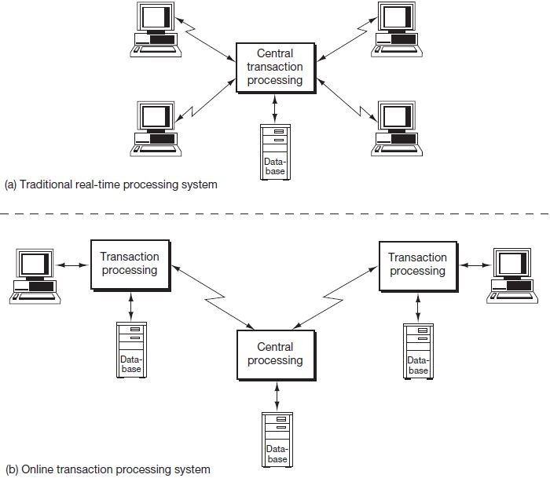

# Sistemas de Gerenciamento de Banco de Dados

## SGBD x Tradicional

**SGDB**:

- Software que permite criar, modificar, eliminar e gerir bases de dados;
- Fornece um conjunto organizado de dados;
- Requisitos funcionais de Segurança, Integridade, Controle de Concorrência, etc.;
- Permite criar relações;

**Abordagem Tradicional**:

- Voltada para a gestão e armazenamento de dados, inclui a criação de esquemas de dados, tabelas, relacionamentos, etc.;
- Poderão exigir experiência e ajuste dos clientes;

Em resumo, os SGBDs oferecem uma maneira mais eficiente e automatizada de gerenciar dados, enquanto a abordagem tradicional pode exigir mais intervenção manual e experiência do usuário.

## Natureza Auto-Descritiva SGBD

O SGBD traz a descrição da sua estrutura e regras (constrains). Para isso, usa um esquema (DB schema), quem é uma estrutra bem-definida dos dados sem utilização das instâncias (os dados).

## Isolamento Program/data e Abstração

Duas estruturas para garantir isolamento.

Abstração é o pilar na independência do programa e dados, e oferecer transparência ao desenvolvedor.

Exemplo de Catálogo:

*Data Item Name* | Starting Position | Length (bytes)
-|-|-
Name | 1 | 30
Student_Nb | 31 | 4
Class | 35 | 1
Major | 36 | 4

## Suporte a Múltiplas Visões (views) dos Dados

Diferentes views para diferentes usuários, em termos de contexto e perspectiva.

Cada tipo de usuário estará interessado em alguns tipos de informações dos dados. A partir de múltiplas tabelas, gera-se uma view read-only

## Compartilhamento de dados e Processamento de Transações Multiusuários

- Transação: programa em execução ou processo que inclui um ou mais acessos ao banco de dados.
- Isolamento: garante que cada transação pareça executar isoladamente ads demais;
- Atomicidade: garante que todas as operações em uma transação sejam executadas ou que nenhuma seja.

**Concurrency Control**: Mecânismos para manter os dados coerentes, que os dados não se modifiquem exceto por uma ação especifica de atualização.

**Online Transaction Processing (OLTP)**: Abordagem de acesso simultâneo com uma sucessão de operações (Insert, Delete, Update) agregadas a uma transação.

## Atores em Banco de Dados

- Design, Manutenção e Usabilidade
- Designer - Modelagem:
  - Identificar dados e requisitos;
  - Representação e Estrutura;
  - Fase preliminar;
- Administrador - DBA:
  - Gerencia Recursos (Base de Dados, SGBD, Softwares Adicionais);
  - Orquestração;
  - Autorização de Acesso;
- Usuários Finais
  - Acesso, Querys (Update, Reports);
  - Categorizados:
    - Casuais: Acessos ocasionais, diferentes informações, uso de APIs;
    - Ingênuos (naive): Considerável porção, *Canned Transactions* (Encapsulamento por linguagem de programação, api gráficas), erro raro;
    - Sofisticados: Já possuem uma noção ou conhecimento prévio do sistema.
    - Standalone: usuário que possui um DB pessoal.
