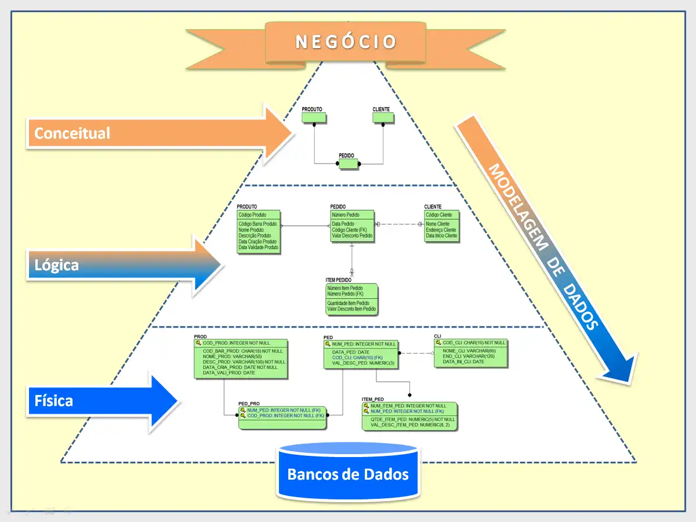
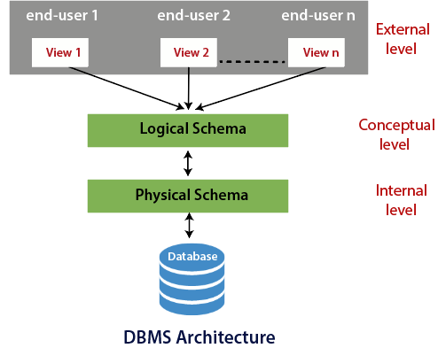
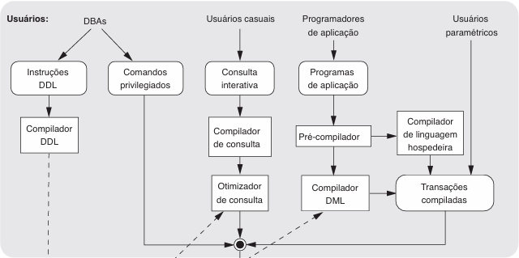
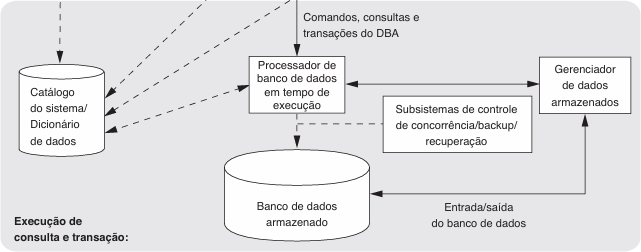
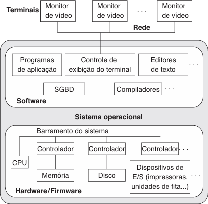
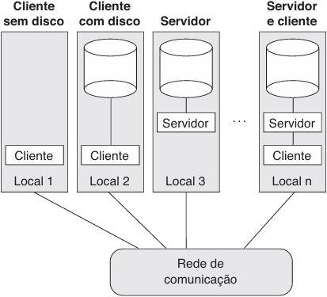
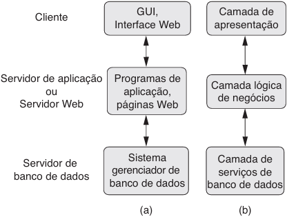

# Arquitetura de Banco de Dados

## Modelos

Visam apresentar Entidade, Atributos e Relacionamento.

- **Modelo de Dados Conceitual** (Alto Nível): Projeta os dados o mais próximo possível da visão que o usuário tem dos dados;
- **Modelo Representativos/Lógico**: Modelo intermediário com tabelas e colunas criadas, tipos de dados, chaves primárias e estrangeiras, e restrições definidas;
  - Modelo de dados relacional;
  - Modelo de rede e hierárquicos;
- **Modelo de Dados Físico** (Baixo Nível): Fornece uma visão mais detalhada de como os dados estão armazenados no computador;

- **Entidade**: representa um objeto ou conceito do mundo real.
- **Atributo**: representa uma propriedade de interesse que descreve melhor uma entidade.
- **Relacionamento**: representa uma associação entre duas ou mais entidades.
- **Esquema**: descrição do banco de dados, que é específicado durante o projeto do mesmo.
  - Cada objeto/entidade é chamado de **construtor do esquema**;
  - Nomes, tipos, restrições;
  - Equivalente ao estado inicial que é vazio;
- **Estado**: dados no banco de dados em determinado momento no tempo.
  - Cada Insert, Delete e Update geram uma **mudança de estado**;

## Arquitetura de Três Esquemas

O objetivo da arquitetura de três esquemas, é separar as aplicações do usuário do banco de dados físico, com base em três características da abordagem de banco de dados:

- Suporte para múltiplas visões do usuário (views).
- Isolamento de programas e dados (independência entre dados do programa e operação do programa).
- Uso de um catálogo para armazenar a descrição (esquema) do banco de dados para torná-lo autodescritivo.

- Externo: inclui uma série de esquemas externos ou visões do usuário. Cada esquema descreve uma parte do banco de dados a um determinado grupo de usuários.
- Conceitual: descreve a estrutura do banco de dados inteiro para uma comunidade. Se concentra na descrição de entidades, tipos de dados, relacionamentos, operações do usuário e restrições.
- Interno: usa modelo de dados físico e descreve os detalhes completos do armazenamento e acesso de dados.

## Linguagens

- **Data Definition Language (DDL)**: linguagem utilizada para definir a estrutura ou esquema do banco de dados. Ela permite que os usuários criem, modifiquem e excluam objetos no banco de dados.
  - Definir tabelas, índices, views, restrições e acesso;
- **Storage Definition Language (SDL)**: linguagem, menos comum, específica para cada sistema de gerenciamento de banco de dados. Ele lida com detalhes relacionados ao armazenamento físico dos dados.
  - Definir o esquema interno, a estrutura física da tabela e mapear entre esquemas;
- **View Definition Language (VDL)**: linguagem utilizada para definir visões (views).
  - Visões são consultas salvas que podem ser tratadas como tabelas virtuais, representações personalizadas dos dados existens.
- **Data Manipulation Language (DML)**: linguagem que o SGBD oferece com um conjunto de operações para finalidades de manipulação dos dados.
  - **Alto Nível (não procedural)**: Utilizada para especificar operações de banco de dados complexas de forma concisa. permite que os usuários especifiquem o que desejam fazer, sem se preocupar com os detalhes de como a operação será executada.
  - **Baixo Nível (procedural)**: Deve ser embutida em uma linguagem de programação de uso geral. Geralmente utilizadas para recuperar registros individuais ou objetos do banco de dados, processando cada um deles separadaamente, precisando de construções de linguagem de programação como o looping.

- **Structured Query Language (SQL)**: linguagem de consulta popular que é frequentemente usada em todos os tipos de aplicações. Representa uma combinação de DDL, VDL e DML;
  - Consultar dados;
  - Definir e manipular dados;
  - Criar e excluir bancos, tabelas, views e outros objetos;
  - Programar Stored Procedures, Triggers e Funções;
  - Configurar permissões de acesso;
  - Pode ser embutido em outras linguagens;
  - DDL (Definition): `CREATE`, `ALTER`, `DROP`, `TRUNCATE`;
  - DML (Manipulation): `INSERT`, `UPDATE`, `DELETE`, `SELECT INTO`;
  - DCL (Control): `GRANT`, `DENY`, `REVOKE`;
  - DQL (Query): `SELECT`;
  - TCL (Transaction Control): `BEGIN`, `SET`, `COMMIT`, `ROLLBACK`, `SAVEPOINT`;

## Interfaces

- **Web Clients**: Apresentam ao usuário uma lista de opções (menus) que acompanham passo a passo o usuário na formulação de uma solicitação.
- **App Mobile**: Similar ao Web Clients, com adaptações para dispositivos móveis.
- **Forms**: Os usuários podem preencher informações de entradas de formulários para inserir novos dados ou preencher certas entradas para o SGBD recuperar os dados correspondentes.
- **Gráficas** (GUI): Geralmente apresenta um esquema para o usuário em formato de diagrama manipulável para consultas. Podem utilizar menus, formulários e dispositivos de apontamento (mouse).
- **Linguagem Natural**: Aceitam solicitações escritas em um idioma e tentam entendê-las. Costuma ter um esquema semelhante ao esquema conceitual do banco de dados e um dicionário de palavras importantes, para assim realizar uma consulta (Alexa, Google, etc.).
  - **Pesquisa Keyword**: Realiza consultas baseadas em palavras-chaves, sem necessariamente interpretar um texto.
- **Entrada e Saída de voz**: Similar à Linguagem Natural. Usa de uma biblioteca de palavras predefinidas para interpretar entradas e converter saídas.
- **Naive**:
  - **Paramétricas**: Possuem pequeno conjunto de operações que precisam realizar repetidamente (caixa de auto-atendimento, caixa bancário).
  - **DBA**: Focado para comandos privilegiados de administradores, como criar contas, definir parâmetros, conceder autorização, etc.

## Ambientes e Utilities

Um SGBD é ser composto tipicamente por módulos de Usuários (e suas interfaces) e de Execução de Consulta e Transação (detalhes internos responsáveis pelo armazenamento de dados e processamento de transações).

- Banco de dados e catálogo SGBD são habitualmente armazenados em disco;
- O acesso ao disco é controlado, em especial, pelo Sistema Operacional (SO);
- Muitos SGBD possuem o próprio módulo de gerenciamento de buffer para planejar a leitura/escrita em disco (desempenho);
- Um módulo gerenciador de dados armazenados controla o acesso às informações do SGBD que estão em disco, seja parte do banco de dados ou do catálogo.

- Ilustra vários usuários e suas interfaces;
- DBAs definem o banco de dados e realizam ajustes;
  - Um compilador DDL processa as definições de esquema especificadas e armazena as descrições dos esquemas (metadados) no catálogo do SGBD.
- Usuários casuais interagem usando alguma forma de interface, chamada consulta interativa:
  - Essas consultas são analisadas e validadas, de acordo com certos critérios, pelo compilador de consulta, que as compila para um formato interno.
  - Um otimizador de consulta preocupa-se com o rearranjo e a possível reordenação de operações, com eliminação de redundâncias e uso dos algoritmos e índices corretos durante a execução.
- Programadores de aplicação escrevem programas em linguagens hospedeiras (Java, C, C++, etc.):
  - O pré-compilador extrai comandos DML do programa de aplicação escrito em uma linguagem hospedeira
    - Esses comandos são enviados ao compilador DML para serem compilados em código objeto para o acesso ao banco de dados;
    - O restante do programa é enviado ao compilador da linguagem hospedeira.
  - Ambos serão ligados, formando uma transação programada, cujo código executável inclui chamadas para o processador de banco de dados em tempo real.
- Transações programadas são executadas repetidamente pelos usuários paramétricos, que apenas forncem os parâmetros para as transações. Cada execução é considerada uma transação separada.

- Processador de banco de dados em tempo de execução executa comandos privilegiados, planos de consulta executáveis e transações programadas.
  - Trabalha com o catálogo do sistema e pode atualizá-lo com estatísticas;
  - Trabalha com o gerenciador de dados armazenados;
    - Utiliza os serviços básicos do sistema operacional para executar operações de entrada/saída de baixo nível entre o disco e a memória principal
  - Cuida de outros aspectos da transferência de dados, como o gerenciamento de buffers na memória principal.
- Alguns SGBD possuem o próprio módulo de gerenciamento de buffer, enquanto outros dependem do SO. O Subsistema de controle de concorrência/backup/recuperação são integrados ao processador de banco de dados em tempo de execução para fins de gerenciamento de transação.

Os utilitários ajudam o DBA a gerenciar o sistema, podendo terem as funções:

- **Carga**: usado para carregar os arquivos de dados existentes (como arquivos de texto ou arquivos sequenciais) no banco de dados.
- **Backup**:  cria uma cópia de segurança do banco de dados.
- **Reorganização do armazenamento do banco de dados**: usado para reorganizar um conjunto de arquivos do banco de dados em diferentes organizações de arquivo, e cria novos caminhos de acesso para melhorar o desempenho.
- **Monitoração de desempenho**: Esse utilitário monitora o uso do banco de dados e oferece estatísticas ao DBA.

## Arquitetura Modelo Cliente-Servidor

- **Arquitetura Física Centralizada** (antiga): usavam computadores mainframe para oferecer o processamento principal para todas as funções do sistema, incluindo programas de aplicação do usuário e programas de interface com o usuário, bem como toda a funcionalidade do SGBD. Portanto, todo o processamento era realizado remotamente no computador central, e somente informações de exibição e controles eram enviados do computador para os terminais de vídeo, que eram conectados ao computador central por meio de vários tipos de redes de comunicações.

- **Arquitetura Cliente/Servidor**: lida  com ambientes de computação em que um grande número de PCs, estações de trabalho, servidores de arquivos e etc. são conectados por uma rede.
  - São definidos servidores especializados para funcionalidades específicas.
  - As máquinas clientes oferecem ao usuário as interfaces apropriadas para utilizar esses serviodres, bem como poder de processamento local para executar aplicações.

- **Arquitetura Cliente/Serviodr de Duas Camadas para SGBDs**: é um modelo no qual os usuários clientes executam aplicativos que fazem solicitações de serviços a um servidor que armazena e gerencia o banco de dados.
  - No lado do cliente estão interfaces e os programas de aplicação
  - A SQL criou um ponto de divisão lógico entre cliente e servidor.
  - No lado do servidor estão as funcionalidades de consulta e de transação relacionadas ao processamento da SQL.

- **Arquitetura de Três Camadas**: é um modelo de design de sistema que divide as funções do sistema em três camadas lógicas: a camada de apresentação, a camada de lógica de negócios e a camada de dados. Cada camada tem responsabilidades específicas e pode ser desenvolvida e mantida de forma independente das outras.
  - Camada de Apresentação: camada que os usuários interagem diretamente (GUI, Interface Web). Responsável por exibir os dados ao usuário e interpretar as ações do usuário;
  - Camada Lógica de Negócios: camada onde todas as regras de negócios são aplicadas (Programas de aplicação, páginas Web). Nesta camada que as decisões são tomadas, os cálculos são realizados e todas as regras de processamento são aplicadas;
  - Camada de Dados: camada é onde os dados são armazenados e recuperados (sistema gerenciador de banco de dados). Ela interage com a camada de lógica de negócios para buscar dados e salvar as alterações nos dados.
  - Vantagens: separação clara de responsabilidades, facilitando manutenção e escabilidade do sistema; melhora na produtividade e qualidade do software;
  - Desvantagens: aumento de complexidade de desenvolvimento; impacto no desempenho pela comunicação entre as camadas;

## Classificação de SGBDs

Parâmetros:

- Modelo de dados: SQL e NoSQL;
- Número de usuários;
- Número de sites;
- Custo;
- Tipo de caminho de acesso;
